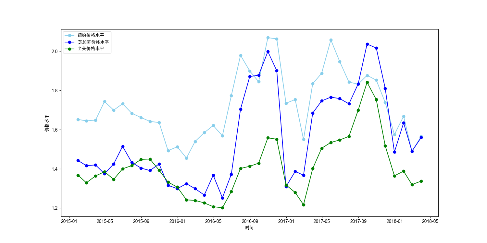

# Data Analysis(Fundamental) Projects

## Project 1: Transaction Data Cleaning

### Introduction

CC has been given a copy of the 2018.01.01 - 2019.06.30 platform sales order data. She needs to clean this data.


**Goal:** In the dataset, whether there are missing values, outliers, duplicates, you need to make your own judgment. Then it will be processed. (All outliers, it's impossible that value < 0).
Finally, output the cleaned results with info().

**Takeaway:** When processing data cleaning, MUST follow those steps in correct order: missing values -> outliers -> duplicates.

## Result

```
<class 'pandas.core.frame.DataFrame'>
Int64Index: 84992 entries, 1 to 86132
Data columns (total 9 columns):
 #   Column         Non-Null Count  Dtype         
---  ------         --------------  -----         
 0   order_id       84992 non-null  int64         
 1   user_id        84992 non-null  int64         
 2   payment        84992 non-null  float64       
 3   price          84992 non-null  float64       
 4   items_count    84992 non-null  int64         
 5   cutdown_price  84992 non-null  float64       
 6   post_fee       84992 non-null  float64       
 7   create_time    84992 non-null  datetime64[ns]
 8   pay_time       84992 non-null  datetime64[ns]
dtypes: datetime64[ns](2), float64(4), int64(3)
memory usage: 6.5 MB
```
As we can see, the data has been cleaned, and all columns have the same amount of data.


## Project 2: Avocado Index

### Introduction

We can't live without avocados anymore, and the price of avocados can be a sideways reflection of a region's standard of living.

Binbin, who lives in New York City, obtained avocado price data for major cities across the U.S. from 2015-2018: Date indicates the date of the price survey, AveragePrice indicates the average price for the day, and region indicates the city of the survey.


Binbin wants to obtain the average monthly avocado prices for New York ("NewYork") and Chicago ("Chicago") for the period 2015-2018, and to calculate the average monthly avocado prices for the entire United States, drawing 3 line graphs for comparison.


### Result

The result as follow:



## Project 3: Batch visualization

### Introduction

In the real world, if we want to visualize the analysis process, as the types of goods increase, the visualization process needs to repeat similar codes many times, which is very unscientific. In this project, we will use loops to batch generate visualizations.

### Result

