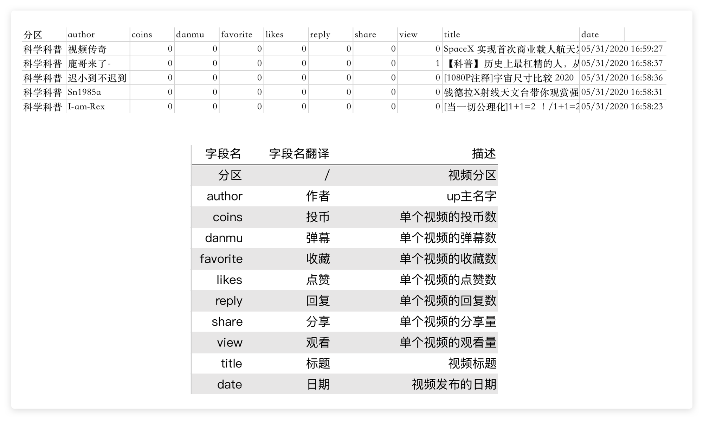
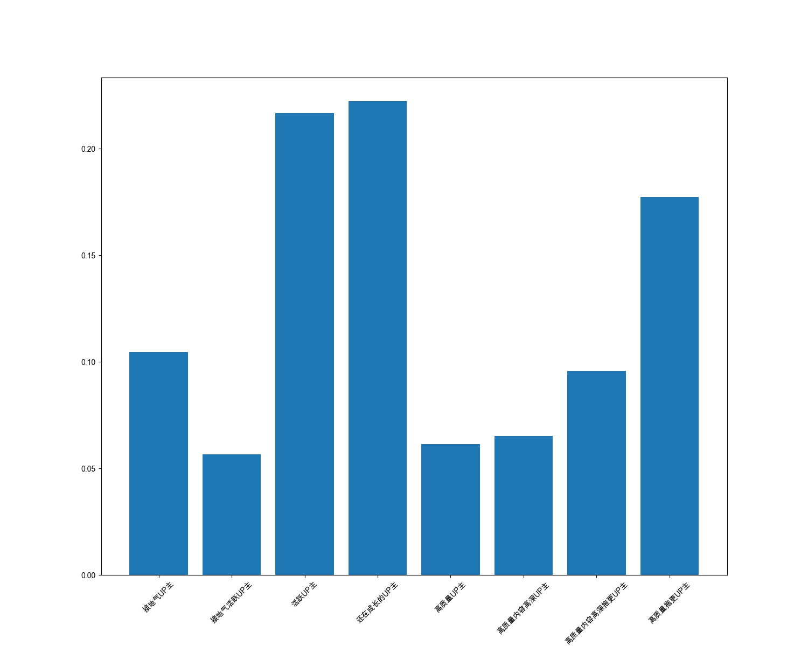
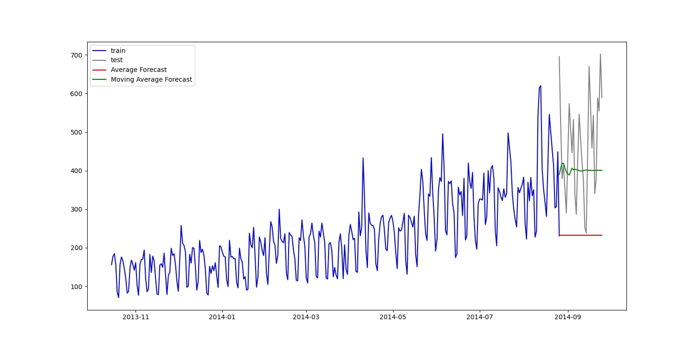
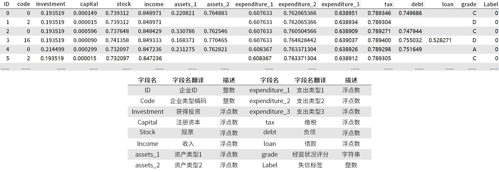

# Data Analysis Projects

## Project 1: RFM User Stratification

### Introduction

Lele obtained the video data of the "Science Popularization" section from a video website, as shown in the figure below. She wanted to classify the type of up owners in this section based on the IFL model.

**IFL model:**

- I: Interaction_rate represents the average interaction rate of each video
- F: Frequency represents the average release cycle of each video
- L: Love_rate represents the average like rate of the video

*Similar to RFM just replace letter.*

### Result

As shown below:

## Project 2: Commuter Number Prediction

### Introduction

This project involves a dataset obtained from an online high-speed rail service, including fields like ID, Datetime, and Count. The dataset spans from August 25, 2012, to September 25, 2014. It's split into training and testing sets to predict future commuter numbers. The testing set represents the actual data to compare against predictions made using the Direct Mean Method and Moving Mean Method.

The primary goal here is to understand how the moving average can be used for time series prediction, without overly focusing on the accuracy of the predictions.

### Result

As the project was completed on a course website, the path will not work in a github. The code is for display only.

Here is a sample/expected output: 

---

## Project 3: Defaulting Companies Prediction

### Introduction

Feifei, the owner of a major computer service contracting company, has records of some companies listed as defaulting due to their inability to fulfill contract promises. Such situations cause losses to her company, so she aims to develop a model to predict a company's defaulting status.

**Data**

Her business data is shown in the following image:

The dataset contains numerous missing values. Feifei plans to fill the missing values in the 'debt' and 'loan' columns with 0, and use linear regression to predict and fill missing values in 'capital', 'assets_1', 'assets_2', 'expenditure_3', and 'tax'. A classification decision tree model is then used, with the final output being the AUC evaluation metric.

### Result

Here are sample/expected outputs: 

0.939541610646035 0.9561061206091632

*Note: As the project was completed on a course website, the path will not work in a github. The code is for display only.*