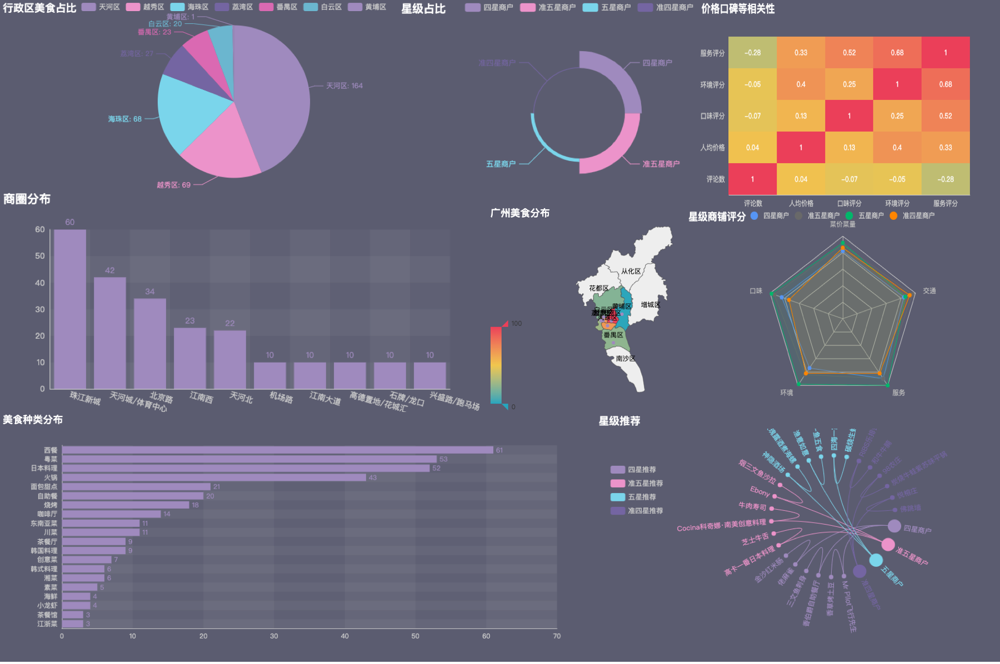

# Visualization Dashboard

## Introduction

MuMu, a food enthusiast, has a passion for culinary adventures. Before embarking on a winter vacation to Guangzhou to explore its delicacies, MuMu collected data on Guangzhou's local cuisine. The data, already processed and ready to use, aims to showcase various aspects of the culinary scene in Guangzhou. This includes the proportion of cuisine types in each district, star rating distributions, business area spreads, correlations between price and reputation, distribution of food types, geographical distribution maps, radar charts of star-rated establishments, and relationship graphs between star-rated establishments and their recommended dishes. The task involves creating pie charts, rose charts, bar graphs, heat maps, horizontal bar charts (bar graphs), maps, radar charts, and relationship graphs, all to be presented in a visualization dashboard format.

### Preview

This is the preview of the visualization dashboard.

*Note: Course is taken Non-English so output result is also Non-English.*

## Result

Due to the project being conducted on a course website, the paths provided in the code will not be functional in a local environment. Therefore, the code is only for display purposes.

### Sample/Expected Output

If you want to explore dynamic visualization html, please navigate to follow link, run code and open in brower:

[Separate_show](./Element/Separate.html)

[All_in_one](./Element/All_in_one.html)
