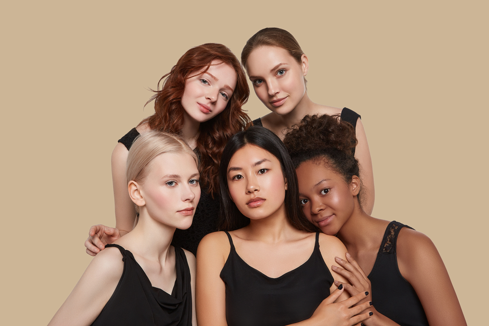
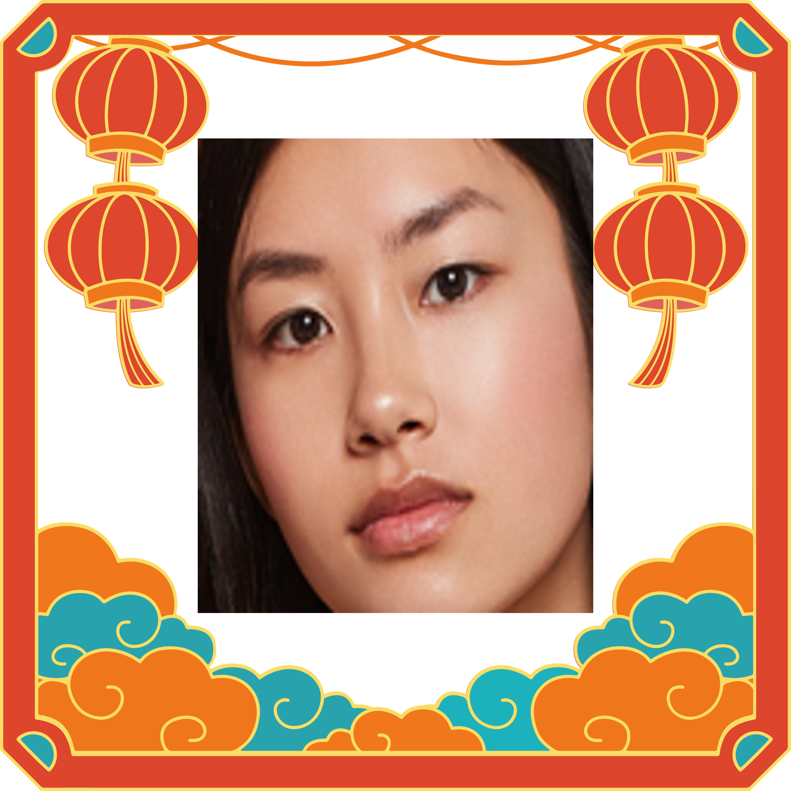

# New Year's Lucky Draw

## Introduction

The final implementation effect of this project is: the user uploads a group photo, randomly selects a lucky person in the group photo, and generates a photo of the lucky person as the basis for the lottery~
For example: the user uploads a picture like this:

## Result

The result is as follows:

Notes: The code might not works since file path are differ.