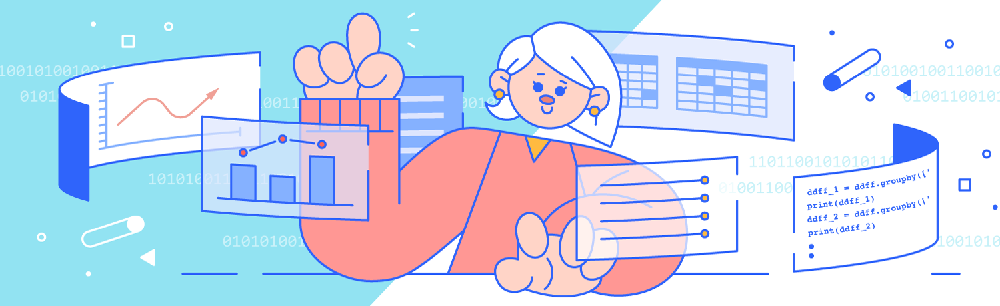

# Application of Python

## Nocturne_Projects

Note: Some part is undone.

Please note this course is Non-English course, which all informaton such as comments, picture are also Non-English, but translate version in README avaiable.

## Courses

### Introductory Python Course

**Content**: Cover data operations, conditional judgment, loops, functions, classes, and objects.

Complete Course Syllabus&Content(Non-English): 

### Data Analysis(Fundamental)

**Content**: Introductory course covers NumPy, Pandas, data cleansing, data visualization, and other basic knowledge, whole class is based on Python.

Brief Syllabus:
| Lesson Number | Topic |
|---------------|-------|
| Lesson 1      | Step of Data Analysis |
| Lessons 2-11  | NumPy and Pandas Basics |
| Lessons 12-14 | Data Cleaning |
| Lessons 15-18 | Data Visualization Basic |
| Lessons 19-20 | Descriptive Analysis |
| Lessons 21-23 | Grouping and Aggregation |
| Lessons 24-25 | Union and Merge |

Complete Course Syllabus&Content(Non-English): 

**Projects**: Simple Mean Prediction and Moving Mean Prediction for predicting the number of commuters and defaulted companies.

### Data Analysis(Advanced)

**Content**: Includes intelligent recommendation (KFM model), association rules, regression analysis, etc.

Complete Course Syllabus&Content(Non-English): 

**Projects**: Simple Mean Prediction and Moving Mean Prediction for predicting the number of commuters and defaulted companies.

### SQL Data Query and Processing

**Content**: Covers basic lookups, aggregation, statistics, multi-table processing, and Python interactions.

Complete Course Syllabus&Content(Non-English): 

**Projects**: Red Packet Collection Analysis using SQL.

### Data Visualization

**Content**: Covers comparison and trend, composition and difference, part and whole, location, and density.

Complete Course Syllabus&Content(Non-English): 

**Projects**: Various visualizations including pie charts, rose charts, histograms, heat maps, horizontal bar charts, distribution maps, radar charts, and relationship graphs.

### Artificial Intelligence Applications

**Content**: Covers natural language processing, image recognition, face recognition, text recognition, speech recognition (using API).

Complete Course Syllabus&Content(Non-English): 

**Projects**: Face detection in images, mask detection using API.

---
## Additional Course

### Web Crawler

**Content**: Covers web page requests and parsing, text crawling, image crawling, anti-crawling strategies.

Complete Course Syllabus&Content(Non-English): 

**Projects**: Property listing analysis using crawler technology.

## Web Development Basics

## Fun Tools

## Office Efficiency

For more details about the projects in each course, please explore the respective folders.

This course is taken at Baicizhan. 

For more information, please go to [np.baicizhan.com](http://np.baicizhan.com) (Non-English Site).
