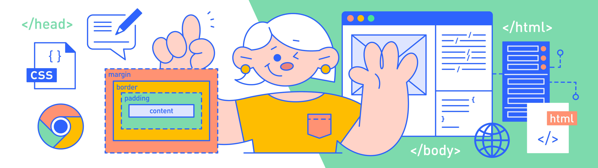

# Application of Python

## Nocturne Projects Intro

This is a series total of 10 Python class that include vaies of content, taken on 2021. Since this is done 2 year and more ago, I'm reviewing them right now.

Below is the course list:

*Notes: Some courses complete Course are not updated yet.*

## Courses

### Introductory Python Course

**Content**: Cover data operations, conditional judgment, loops, functions, classes, and objects.

Complete Course Syllabus&Content(Non-English): 

*Notes: Reviewed.*

### Data Analysis(Fundamental)

**Content**: Introductory course covers NumPy, Pandas, data cleansing, data visualization, and other basic knowledge, whole class is based on Python.

Brief Syllabus:
| Lesson Number | Topic |
|---------------|-------|
| Lesson 1      | Step of Data Analysis |
| Lessons 2-11  | NumPy and Pandas Basics |
| Lessons 12-14 | Data Cleaning |
| Lessons 15-18 | Data Visualization Basic |
| Lessons 19-20 | Descriptive Analysis |
| Lessons 21-23 | Grouping and Aggregation |
| Lessons 24-25 | Union and Merge |

Complete Course Syllabus&Content(Non-English): 

**Projects**: Simple Mean Prediction and Moving Mean Prediction for predicting the number of commuters and defaulted companies.

*Notes: Reviewed.*

### Data Analysis(Advanced)

**Content**: Includes intelligent recommendation (KFM model), association rules, regression analysis, etc.

Brief Syllabus:
 
| Lesson Number | Topic |
|---------------|-------|
| Lesson 1 | Step of Data Analysis |
| Lessons 2-6 | Movie Intelligent Recommendation (Collaborative Filtering) |
| Lessons 7-9 | Association Analysis and Apriori Algorithm |
| Lessons 10-12 | Discretization and Data Binning (R,F,M) |
| Lesson 13 | Introduction to Machine Learning |
| Lessons 14-16 | Linear Regression Analysis |
| Lessons 17-19 | Decision Trees |
| Lesson 20 | Cluster Analysis (K-Mean) |
| Lessons 21-22 | Basics of Quantitative Trading |
| Lessons 23-25 | Timing Strategy |

Complete Course Syllabus&Content(Non-English): 

**Projects**: Simple Mean Prediction and Moving Mean Prediction for predicting the number of commuters and defaulted companies.

*Notes: To be reviewed.*

### SQL Data Query and Processing

**Content**: Covers basic lookups, aggregation, statistics, multi-table processing, and Python interactions.

Brief Syllabus:
| Lesson Number | Topic |
|---------------|-------|
| Lessons 1-5  | Basic Searching |
| Lessons 6-9  | Aggregate Statistics |
| Lessons 10-16 | Multi-table Processing |
| Lessons 17-21 | Python Interaction |
| Lessons 22-25 | Comprehensive Application in Practice |

Complete Course Syllabus&Content(Non-English): 

**Projects**: Red Packet Collection Analysis using SQL.

*Note: Review in progess.*

### Data Visualization

**Content**: Covers comparison and trend, composition and difference, part and whole, location, and density.

Brief Syllabus:

| Lesson Number | Topic |
|---------------|-------|
| Lesson 1     | Process and Thought |
| Lessons 2-5  | Comparison and Trends |
| Lessons 6-7  | Composition and Differences |
| Lessons 8-10 | Part and Whole |
| Lessons 11-14 | Position and Density |
| Lessons 15-17 | Distribution and Circulation |
| Lessons 18-23 | Connection and Correlation |
| Lessons 24-25 | Summary and Extension |

Complete Course Syllabus&Content(Non-English): 

**Projects**: Various visualizations including pie charts, rose charts, histograms, heat maps, horizontal bar charts, distribution maps, radar charts, and relationship graphs.

*Notes: To be review.*

### Artificial Intelligence Applications

**Content**: Covers natural language processing, image recognition, face recognition, text recognition, speech recognition (using API).

Brief Syllabus:

| Lesson Number | Topic |
|---------------|-------|
| Lesson 1     | Introduction to Artificial Intelligence |
| Lessons 2-6  | Natural Language Processing |
| Lessons 7-10 | Image Recognition |
| Lessons 11-14 | Face Recognition |
| Lessons 15-16 | Text Recognition |
| Lessons 17-22 | Speech Recognition |
| Lesson 23 | Speech Synthesis |
| Lessons 24-25 | API Use Tutorial |

Complete Course Syllabus&Content(Non-English): 

**Projects**: Face detection in images, mask detection by using API.

*Notes: To be review.*

---
## Other Course

*Notes: To be review.*

### Web Crawler

**Content**: Covers web page requests and parsing, text crawling, image crawling, anti-crawling strategies.

Complete Course Syllabus&Content(Non-English): 

**Projects**: Property listing analysis using crawler technology.

## Web Development Basics

**Content**: HTML basics, CSS basics, content grouping, layout and advanced

Complete Course Syllabus&Content(Non-English): 

**Projects**: Draw a doraemon. 

## Fun Tools

**Content**: Covers QR code tools, drawing tools, PPT tools, design tools, expression tools, translation tools, automatic tools

Complete Course Syllabus&Content(Non-English): 

**Projects**: Randomly selects a lucky person in the group photo.

## Office Efficiency

**Content**: Covers automatic classification of files, reading and classifying photo information, reading and writing Excel, Word, PDF documents, comprehensive office applications

Complete Course Syllabus&Content(Non-English): 

**Projects**: Read into a folder include Word, excel and pdf file, find phone number and add to list.

---

For more details about the projects in each course, please see the respective folders.

This course is taken at Baicizhan. 

For more information, please go to [np.baicizhan.com](http://np.baicizhan.com) (Non-English Site).
