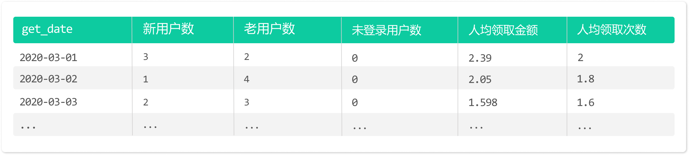

# SQL Data Query and Processing Projects

## Red Packet (Red Envelope) Receipt Analysis

### Background
Recently, Night Song Youshang organized a red packet (red envelope) grabbing event. The boss asked Mingming to analyze the event, starting with classifying users by different attributes, followed by a statistical analysis.

### Data Tables Description
- **User Activity Table (`user_active`)**: Each row records a user ID (`user_id`), login date (`login_date`), and whether they are a new user (`whether_new`).
- **Red Packet Receipt Table (`get_redpacket`)**: This table records the user ID (`user_id`), amount received (`price`), date of receipt (`get_date`), and the exact time of receipt (`get_datetime`).

### Task
Write SQL queries to assist Mingming in the second step of the analysis. This includes calculating the daily count of new users, existing users, and users who didn't log in, as well as the average amount and number of red packets received per user.

### Result

### Additional Notes
- Ensure data accuracy by carefully considering the join conditions between the `user_active` and `get_redpacket` tables.
- Optimize the queries for large datasets, as the event attracted a significant number of participants.

