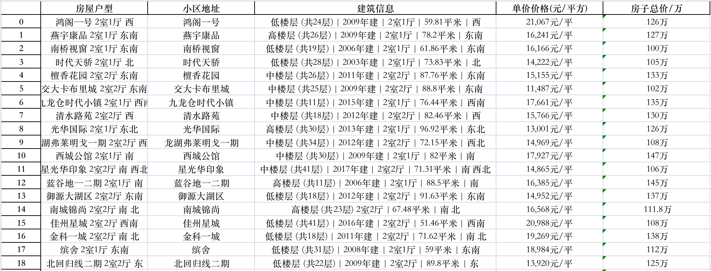

# Web Crawler Projects

## Project Overview

### Understanding the Purpose
Yoyo recently has some spare funds and is looking to invest in a second-hand house priced between 1 to 1.5 million. She aims to acquire comprehensive information about available properties in Chengdu to make a well-informed decision. However, gathering the necessary data for purchasing a house can be overwhelming. How can one quickly obtain property listings? She plans to write a program that retrieves information from the first 5 pages of a specific website and records it in an Excel file. Listings that are no longer available will be excluded from the data collection.

## Results

*Note: Course is taken Non-English so output result is also Non-English.*

